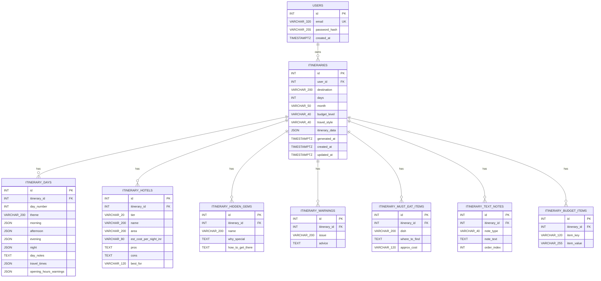
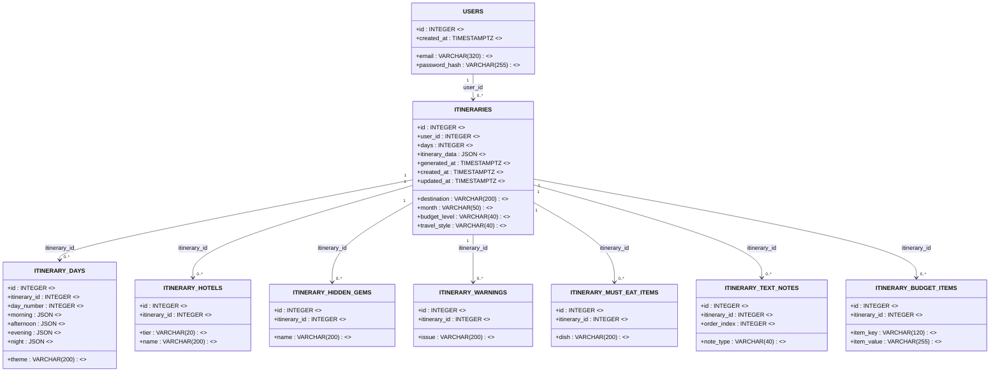
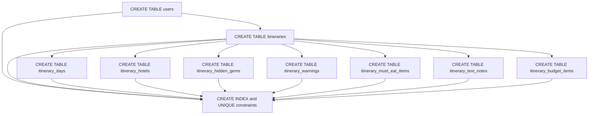
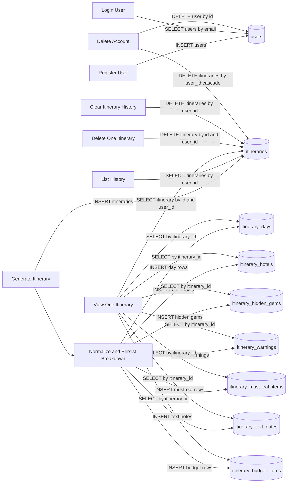

# Database Design (Textbook Format)

This document provides a standard textbook-style database design pack for the AI Evidence-Based Tour Planner backend.

## 1. Requirement Analysis (RA)

### 1.1 Problem Statement
The system must support secure user accounts and persistent itinerary history. Each generated itinerary must be tied to its owner, retrievable in future sessions, and stored in both raw JSON form and normalized relational form for queryability.

### 1.2 Functional Requirements
- FR1: A user can register with unique email and password.
- FR2: A user can log in and receive an authentication token.
- FR3: The system can store generated itineraries for an authenticated user.
- FR4: Itinerary generation must persist a normalized day-wise breakdown.
- FR5: Itinerary generation must persist normalized hotel options by tier.
- FR6: Itinerary generation must persist normalized hidden gems, warnings, and must-eat entries.
- FR7: Itinerary generation must persist normalized text notes (cultural tips, packing notes, notices).
- FR8: Itinerary generation must persist normalized budget breakdown key-value items.
- FR9: A user can list itinerary history.
- FR10: A user can fetch one itinerary by id.
- FR11: A user can delete one itinerary by id.
- FR12: A user can clear all itinerary history.
- FR13: A user can delete account using password confirmation.
- FR14: On account deletion, all related itinerary rows in child tables must be removed.
- FR15: Itinerary storage must preserve the original structured JSON payload for compatibility.

### 1.3 Non-Functional Requirements
- NFR1: Data integrity via primary key, foreign key, and uniqueness constraints.
- NFR2: Security through hashed passwords and token-based authorization.
- NFR3: Query performance through indexes on key lookup fields.
- NFR4: Extensibility for adding new itinerary metadata attributes and new itinerary child tables.

## 2. Data Requirements

### 2.1 Core Entities
- User: stores login identity and account creation timestamp.
- StoredItinerary: stores generated trip metadata and full itinerary JSON payload.
- ItineraryDayPlan: stores per-day schedule blocks and day-level notes.
- ItineraryHotelOption: stores normalized hotel options by budget tier.
- ItineraryHiddenGem: stores hidden places and visit guidance.
- ItineraryWarning: stores safety or planning warnings.
- ItineraryMustEatItem: stores food recommendations.
- ItineraryTextNote: stores note lists such as cultural tips, packing, and notices.
- ItineraryBudgetItem: stores budget breakdown key-value entries.

### 2.2 Attribute Requirements
- User.email must be unique and non-null.
- StoredItinerary.user_id must reference User.id.
- StoredItinerary.itinerary_data must be non-null JSON.
- Every itinerary child table must include itinerary_id as non-null FK to itineraries.id.
- Day plan JSON blocks (morning/afternoon/evening/night) must be non-null JSON fields.
- Timestamps should be stored with timezone support.

### 2.3 Relationship Requirements
- One User can own zero to many StoredItinerary records.
- One StoredItinerary belongs to exactly one User.
- One StoredItinerary can own zero to many day plans.
- One StoredItinerary can own zero to many hotel options.
- One StoredItinerary can own zero to many hidden gems.
- One StoredItinerary can own zero to many warnings.
- One StoredItinerary can own zero to many must-eat items.
- One StoredItinerary can own zero to many text notes.
- One StoredItinerary can own zero to many budget items.
- Deleting a User cascades to delete owned itineraries.
- Deleting an itinerary cascades to delete all child rows.

## 3. ER Diagram

Notation follows textbook convention: PK = Primary Key, FK = Foreign Key, UK = Unique Key.

## 4. RM (Relational Model)

### 4.1 Relation Schemas
- USERS(id, email, password_hash, created_at)
- ITINERARIES(id, user_id, destination, days, month, budget_level, travel_style, itinerary_data, generated_at, created_at, updated_at)
- ITINERARY_DAYS(id, itinerary_id, day_number, theme, morning, afternoon, evening, night, day_notes, travel_times, opening_hours_warnings)
- ITINERARY_HOTELS(id, itinerary_id, tier, name, area, est_cost_per_night_inr, pros, cons, best_for)
- ITINERARY_HIDDEN_GEMS(id, itinerary_id, name, why_special, how_to_get_there)
- ITINERARY_WARNINGS(id, itinerary_id, issue, advice)
- ITINERARY_MUST_EAT_ITEMS(id, itinerary_id, dish, where_to_find, approx_cost)
- ITINERARY_TEXT_NOTES(id, itinerary_id, note_type, note_text, order_index)
- ITINERARY_BUDGET_ITEMS(id, itinerary_id, item_key, item_value)

### 4.2 Keys and Constraints
- USERS: PK(id), UK(email)
- ITINERARIES: PK(id), FK(user_id) references USERS(id) ON DELETE CASCADE
- ITINERARY_DAYS: PK(id), FK(itinerary_id) references ITINERARIES(id) ON DELETE CASCADE
- ITINERARY_HOTELS: PK(id), FK(itinerary_id) references ITINERARIES(id) ON DELETE CASCADE
- ITINERARY_HIDDEN_GEMS: PK(id), FK(itinerary_id) references ITINERARIES(id) ON DELETE CASCADE
- ITINERARY_WARNINGS: PK(id), FK(itinerary_id) references ITINERARIES(id) ON DELETE CASCADE
- ITINERARY_MUST_EAT_ITEMS: PK(id), FK(itinerary_id) references ITINERARIES(id) ON DELETE CASCADE
- ITINERARY_TEXT_NOTES: PK(id), FK(itinerary_id) references ITINERARIES(id) ON DELETE CASCADE
- ITINERARY_BUDGET_ITEMS: PK(id), FK(itinerary_id) references ITINERARIES(id) ON DELETE CASCADE

### 4.3 RM Diagram

## 5. DDL Design

### 5.1 DDL Dependency Diagram

### 5.2 DDL Script
See [db_schema_ddl.sql](db_schema_ddl.sql).

## 6. DML Design

### 6.1 DML Operation Diagram

### 6.2 DML Script
See [db_sample_dml.sql](db_sample_dml.sql).

## 7. RA (Relational Algebra) for Core Queries

Let U = USERS, I = ITINERARIES, D = ITINERARY_DAYS, H = ITINERARY_HOTELS,
G = ITINERARY_HIDDEN_GEMS, W = ITINERARY_WARNINGS, M = ITINERARY_MUST_EAT_ITEMS,
T = ITINERARY_TEXT_NOTES, B = ITINERARY_BUDGET_ITEMS.

- Q1 (find user by email):
  sigma_{email = e}(U)

- Q2 (user itinerary history):
  tau_{created_at DESC}(sigma_{user_id = uid}(I))

- Q3 (specific itinerary owned by user):
  sigma_{id = iid and user_id = uid}(I)

- Q4 (day-wise breakdown of one itinerary):
  sigma_{itinerary_id = iid}(D)

- Q5 (hotel options of one itinerary):
  sigma_{itinerary_id = iid}(H)

- Q6 (clear all itineraries for user):
  I <- I - sigma_{user_id = uid}(I)
  (dependent tuples in D, H, G, W, M, T, B are removed by FK cascade)

- Q7 (account delete with cascade semantics):
  U <- U - sigma_{id = uid}(U)
  (dependent tuples in I, D, H, G, W, M, T, B are removed by FK cascade)
